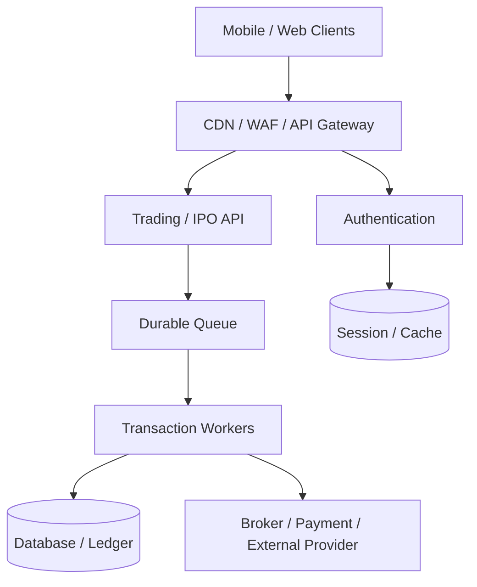
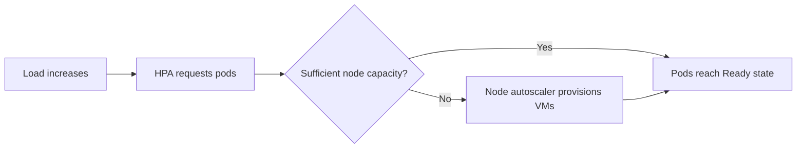
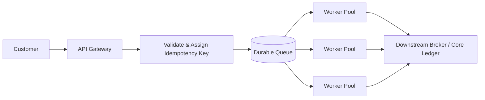
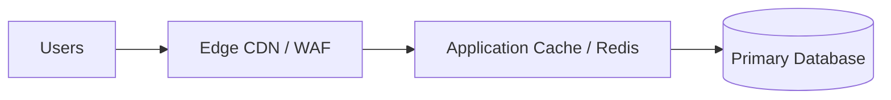
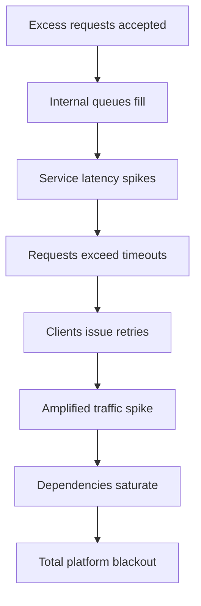
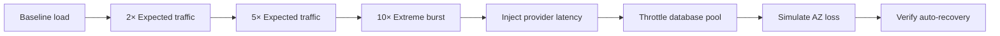

  “A traffic spike is rarely just a ‘server problem.’ At scale, it becomes a systems problem — and very quickly, a business problem.”

The opening of the Dangote Petroleum Refinery IPO on September 14, 2026 became more than a major capital-market event. It also served as a real-world stress test for Nigeria’s digital investment infrastructure.

Public reporting revealed that platforms including Bamboo and Cowrywise experienced service disruptions as retail investors rushed to participate. Reuters reported that Bamboo saw roughly **10× its normal traffic within about 30 minutes**, with the surge placing extreme pressure on upstream infrastructure and downstream market partners.[^1] Premium Times similarly confirmed service disruptions linked directly to the subscription rush.[^2]

That makes this event worth examining through an objective engineering lens.

Not to critique any single company, but because the underlying failure mode is universal across digital businesses: fintech, e-commerce, ticketing, SaaS, payments, and high-concurrency consumer applications.

When massive bursts arrive, simply “adding more servers” rarely solves the problem.

  <strong className="text-kn-heading font-semibold">Editorial Note:</strong> This analysis is not an internal postmortem. It is an independent engineering assessment based on publicly disclosed details, industry reporting, and standard Site Reliability Engineering (SRE) principles.

---

## Why Reliability Matters Far Beyond Engineering

When infrastructure fails during a high-stakes market window, the consequences extend far beyond alerting dashboards:

  

    
Step 1

    
Hears Opportunity

  

  

    
Step 2

    
Funds Account

  

  

    
Step 3

    
Opens App

  

  

    
Step 4

    
Places Order

  

  

    
Failure

    
Transaction Drops

  

1. An infrastructure outage becomes a **customer-experience failure**.
2. If it persists, it transforms into a **trust and brand issue**.
3. Over time, it turns into a **financial and regulatory liability**.

Following the disruption, Bamboo publicly acknowledged the incident and announced a 20% reduction in commissions on U.S. and Nigerian stock trades for the remainder of September.[^3]

Scalability is not merely a DevOps metric. It is a prerequisite for business continuity.

---

## 1. The Wrong Lesson: “We Just Need More Servers”

A common immediate reaction to a traffic-related outage is:

> *“We just need more compute instances.”*

Sometimes additional compute helps. But modern cloud platforms are distributed systems with interdependent boundaries. A simplified investment transaction journey illustrates where pressure accumulates:

Every component in that topology has a finite saturation ceiling.

Scaling application pods from 20 to 200 will not prevent downtime if:

- The primary database exhausts its connection pool,
- An authentication identity provider begins rate-limiting,
- Downstream brokerage or payment APIs throttle requests,
- Hot database row locks cause latency to multiply exponentially,
- Kubernetes HPA spawns pods that cannot be scheduled due to node exhaustion,
- Or aggressive client retries amplify a momentary hiccup into a cascading blackout.

  

    Architectural Law &bull; The Weakest Link Principle
  

  

    
Platform Capacity = MIN(

    

      
edge capacity,

      
application capacity,

      
database capacity,

      
cache capacity,

      
authentication capacity,

      
payment capacity,

      
brokerage capacity,

      
messaging capacity,

      
third-party API capacity

    

    
)

  

  

    A platform is only as resilient as its narrowest bottleneck. Scaling application pods from 20 to 200 will not prevent an outage if any downstream dependency is already saturated.
  

Scalability must be designed and verified **end to end**.

---

## 2. Predictable Events Demand Pre-Scaling, Not Just Reactive Autoscaling

The Dangote IPO was not a surprise viral trend. The opening date, time window, and national anticipation were established well in advance.

Relying solely on reactive autoscaling for scheduled demand is an operational antipattern. Reactive autoscalers wait for CPU or latency to cross thresholds before provisioning new capacity—meaning users feel the pain before the system starts scaling.

A resilient architecture pairs **pre-scaling** with **reactive autoscaling**:

### Essential Pre-Flight Actions
- Raise minimum replica counts on critical ingestion paths 60–90 minutes before opening.
- Ensure node groups have pre-provisioned headroom or warm nodes to avoid cluster expansion delays.
- Warm caches for ticker details, company prospectuses, and static verification assets.
- Verify database connection pool headroom across read and write pools.
- Coordinate rate limits and concurrency ceilings with upstream payment and brokerage partners.
- Position operational incident command rooms with tailored real-time observability dashboards.

KEDA (Kubernetes Event-driven Autoscaling) provides a native **Cron Scaler** to automate scheduled pre-scaling windows,[^4] while Kubernetes Horizontal Pod Autoscaling (HPA) manages dynamic surges.[^5]

---

## 3. CPU Utilization Is an Inadequate Autoscaling Signal

A standard Kubernetes HPA manifest often looks like this:

  <code>targetCPUUtilizationPercentage: 70</code>
  # "When average CPU exceeds 70%, add pods"

While simple, CPU utilization rarely correlates with user experience degradation in I/O-bound financial workloads.

If an API pod safely handles 50 concurrent transactions before database connection limits or downstream locks cause queueing, customer latency may spike at 40 concurrent requests while CPU remains below 45%. If you wait for CPU to reach 70%, users have already experienced timeouts and errors.

Kubernetes HPA supports custom application and external metrics.[^5] For transaction-heavy systems, scale on metrics that reflect true operational pressure:

| Tier | Limiting Resource | Primary Scaling Metric | Secondary Signals |
|---|---|---|---|
| **Edge / Gateway** | Bandwidth & Connections | Active HTTP connections, Concurrency | HTTP 429 / 5xx error ratios |
| **Application Services** | Thread / Worker capacity | p95 / p99 request latency | In-flight requests per pod |
| **Transaction Queues** | Worker throughput | Queue depth, Oldest-message age | Message consumption rate |
| **Kubernetes Cluster** | Node capacity | Pending unscheduled pods | Scheduling latency |
| **Databases** | Connections, IOPS, Locks | Active pool utilization | Lock wait time, Transaction duration |
| **Downstream APIs** | Partner limits | Partner latency & throttling | Circuit breaker trip count |

---

## 4. Pod Autoscaling Without Node Autoscaling Is an Illusion

Consider an HPA configured to expand under load:

  

    4 Pods
    &rarr;
    12 Pods
    &rarr;
    30 Pods
    &rarr;
    60 Pods
  

  

    If your node cluster only possesses compute capacity for 15 pods, the remaining 45 pods remain stuck in:
    

      Status: Pending (Insufficient memory / cpu)
    

  

The application appeared to scale in the orchestrator, but its actual processing throughput remained completely flat.

Cloud VM provisioning typically requires **2 to 5 minutes** to initialize, join the cluster, download images, and pass health checks. In a 30-minute 10× surge, a five-minute scaling delay is the difference between seamless processing and total disruption.[^6]

---

## 5. Protect the Core Journey via Graceful Degradation

Under extreme stress, every feature does not deserve equal priority.

In a retail investment surge, the **critical path** must be defended at all costs:

  
The Protected Transaction Path

  

    1. User Authentication
    &rarr;
    2. View IPO Offering
    &rarr;
    3. Verify Wallet Balance
    &rarr;
    4. Place Order
    &rarr;
    5. Receipt Acknowledgment
  

Meanwhile, non-essential operations should be shed or served stale:

- Historical portfolio performance charts,
- Real-time stock gainers/losers discovery feeds,
- Complex search suggestions,
- Profile analytics and gamification badges,
- Push notification broadcasts.

Google Site Reliability Engineering highlights **Graceful Degradation**: deliberately returning degraded or cached results for secondary features to ensure critical business transactions succeed.[^7]

A customer seeing:
> *“Portfolio analytics are temporarily updating in the background, but your order has been accepted.”*

is a completely satisfied customer compared to one facing a generic `502 Bad Gateway` error.

---

## 6. Decouple Request Acceptance from Downstream Settlement

Synchronous request processing creates rigid couplings: if the downstream broker takes 4 seconds, the mobile app waits 4 seconds, the API thread blocks for 4 seconds, and database connections remain tied up for 4 seconds.

Decoupling acceptance from processing turns an asynchronous queue into a buffer:

### The Ingestion Flow
1. **Validate & Persist**: Validate account balance, attach a cryptographically unique `Idempotency-Key`, and durably persist the transaction order.
2. **Immediate Acknowledgment**: Return an HTTP `202 Accepted` response with an order tracking ID to the customer within milliseconds.
3. **Controlled Draining**: Worker pools drain the queue at a precisely calibrated rate that never overwhelms the database or downstream partners.
4. **Idempotency Guarantee**: If network drops cause the user to tap "Submit" three times, the unique idempotency key guarantees the transaction executes exactly once.

---

## 7. Scaling the API Can Inadvertently Destroy the Database

This is one of the most frequent traps in cloud-native scaling:

  
Connection Multiplying Effect

  

    

      
Normal Baseline (20 Pods)

      
20 pods &times; 50 max pool = 1,000 DB connections

      
Comfortably within primary database connection ceiling.

    

    

      
Auto-Scaled Burst (100 Pods)

      
100 pods &times; 50 max pool = 5,000 DB connections

      
Database crashes under connection exhaustion and RAM starvation.

    

  

To avoid this failure mode:
- **Deploy Connection Pooling Proxies**: Utilize proxy layers like PgBouncer or AWS RDS Proxy between Kubernetes workloads and your primary database.
- **Tune Pool Limits Per Pod**: Ensure the aggregate maximum connections across all possible autoscaled replicas remains safely below the database engine’s limit.
- **Offload Read Traffic**: Route balance queries, catalog lookups, and authentication reads to horizontally scaled read replicas.
- **Identify Slow Queries**: Profile p99 queries under concurrency to catch missing composite indexes before they lock shared tables.

---

## 8. Cache Aggressively, but Guard Against the Cache Stampede

During an IPO, thousands of concurrent users request identical informational assets: company valuations, prospectus files, share prices, and eligibility FAQs.

Serving these requests from Edge CDNs and memory caches protects backend databases for transactional mutations.

However, caches introduce their own critical failure mode: **The Cache Stampede**. If a popular cache key expires during a 10× traffic spike, hundreds of requests will simultaneously miss the cache and hammer the database for the same record.

### Defense Mechanisms
- **TTL Jitter**: Add randomized variance (&plusmn;10–20%) to cache expiration times so thousands of keys do not expire in the same second.
- **Stale-While-Revalidate**: Serve existing cached content immediately while a background thread refreshes the cache asynchronously.
- **Request Coalescing (Singleflight)**: Collapse concurrent requests for the same missing key into a single backend fetch.

---

## 9. Third-Party Providers Form Part of Your Operational Boundary

Reuters noted that Bamboo's traffic surge also put significant strain on third-party integrations.[^1]

Your actual system capacity is never greater than the capacity of your least scalable third-party integration. If an upstream payment gateway or market broker only accepts 800 transactions per second, scaling your API to push 10,000 transactions per second will merely trigger timeouts, network congestion, and provider IP bans.

### Defensive Integration Patterns
- **Circuit Breakers**: Detect downstream latency spikes and trip early to prevent thread pooling.
- **Exponential Backoff & Full Jitter**: Prevent the "thundering herd" by spacing out retries with randomized delays.
- **Retry Budgets**: Limit retries to a fixed percentage (e.g., maximum 10%) of total request volume.
- **Provider-Aware Concurrency Semaphores**: Cap concurrent in-flight requests to external endpoints.

---

## 10. Load Shedding: Why Resilient Systems Reject Work

It feels counterintuitive to deliberately drop incoming traffic. Yet a system that attempts to process more work than its physical hardware permits will soon process nothing at all.

  

    

      
Safe Operational Capacity

      
10,000 req / sec

    

    
vs. Sudden Burst

    

      
Uncontrolled Demand

      
30,000 req / sec

    

  

If the platform indiscriminately accepts all 30,000 requests, a compounding failure cascade begins:

Google Site Reliability Engineering formalizes this strategy as **Load Shedding**.[^8] Dropping excess non-critical traffic with HTTP `429 Too Many Requests` or clean virtual waiting rooms allows the core engine to operate at peak efficiency rather than collapsing entirely.

---

## 11. High Availability Extends Beyond `replicas: 6`

Setting `replicas: 6` in a Kubernetes Deployment manifest does not make a workload highly available. If the scheduler places all six pods on a single underlying EC2 or Compute Engine instance, a single host failure terminates all availability.

### Real High Availability Checklist
- **Pod Topology Spread Constraints**: Distribute pods evenly across physical nodes and separate Availability Zones.[^9]
- **Readiness Probes**: Prevent traffic from reaching starting pods until database pools, warm caches, and internal configs are fully verified.[^10]
- **Pod Disruption Budgets (PDB)**: Enforce a minimum threshold of online pods during voluntary disruptions like node upgrades and cluster maintenance.[^11]
- **Resource Requests & Limits**: Ensure CPU and memory boundaries are tuned to prevent OOMKills from triggering unexpected eviction storms.

---

## 12. Load Test Failure Modes, Not Just the Happy Path

Engineering teams preparing for national-scale events often stop testing once the happy path passes rated capacity:
> *“Can the system complete 10,000 requests per second under ideal conditions?”*

The far more valuable question is:
> *“What breaks first when 25,000 requests per second arrive, and how does the platform recover?”*

### Critical Metrics to Measure During Chaos Testing
1. **Latency Distribution**: Track p95 and p99 metrics rather than misleading p50 averages.
2. **Cluster Scaling Speed**: Record exact seconds required for node provisioning and pod warmup.
3. **Queue Drainage Dynamics**: Confirm whether queue backlog clears without manual intervention once load subsides.
4. **Failure Domain Isolation**: Verify that an outage in one downstream service does not take down unrelated features.

---

## 13. Elasticity: Balancing Resilience with Cost Efficiency

Commercial sustainability is fundamental to good architecture. Operating at peak capacity year-round wastes vital capital:

  

    

      
Standard Day

      
10 compute instances (Cost-efficient baseline)

    

    
&harr;

    

      
Major Market Event

      
100 compute instances (Elastic burst)

    

  

Running 100 instances 365 days a year is financially unsustainable. True cloud maturity is defined by elasticity:

| Operational Phase | Capacity Posture | Primary Objectives |
|---|---|---|
| **Normal Operations** | Lean, rightsized baseline | Minimize cloud expenditure, enforce rightsizing |
| **Pre-Event (T-2 Hours)** | Scheduled pre-scale | Eliminate node expansion delays, pre-warm connections |
| **Active Surge** | Dynamic reactive scaling | Absorb demand, safeguard database ceilings |
| **Peak Overload** | Queue buffering & load shedding | Reject excess gracefully, defend core transaction flow |
| **Post-Event (T+2 Hours)** | Controlled consolidation | Scale down worker fleets gracefully without dropping in-flight jobs |

---

## 14. The Executive Peak-Event Dashboard

Before launching a major campaign or IPO subscription, technical leadership should monitor a unified dashboard tracking both infrastructure health and customer outcomes:

| Domain | Core Operational Question | Target Indicator |
|---|---|---|
| **Ingress Traffic** | How many requests per second are hitting the edge? | Ingress RPS, Concurrency |
| **User Experience** | Are customers experiencing lag? | p95 latency &lt; 500ms, p99 &lt; 1200ms |
| **Platform Health** | What percentage of total traffic is succeeding? | HTTP 5xx error rate &lt; 0.05% |
| **Kubernetes Fleet** | Are pods ready and scheduled? | Ready replicas vs. Desired replicas |
| **Compute Nodes** | Are any pods waiting in Pending state? | Pending pods = 0 |
| **Primary Database** | Are connections, CPU, or locks saturating? | Pool utilization &lt; 75%, CPU &lt; 70% |
| **Memory Cache** | Is cached content shielding the database? | Redis / Memcached hit ratio &gt; 92% |
| **Ingestion Queues** | Is backlog clearing at an acceptable rate? | Queue age &lt; 30s |
| **External Providers** | Are third-party brokers throttling? | Provider response times & error rates |
| **Business Outcomes** | Are funded users completing checkout? | End-to-end transaction success rate &gt; 99% |

---

## The Broader Lesson for the African Tech Ecosystem

The Dangote IPO demonstrated something remarkable: immense digital appetite from retail investors willing to participate in high-value financial markets through their mobile devices.

Customer demand in emerging markets now moves at internet speed. A viral campaign, regulatory policy shift, or landmark IPO can bring tomorrow’s traffic today.

Designing for this reality requires recognizing that:

> **Normal baseline traffic is rarely the traffic that defines your business.**

Resilient platforms don't claim infinite capacity. Instead, they:
- Know and measure their operational boundaries,
- Pre-position capacity for anticipated events,
- Safeguard databases with intelligent buffering,
- Degrade non-critical features under pressure,
- And maintain economic discipline when traffic returns to normal.

---

## Peak-Event Engineering Readiness Checklist

Before your next major launch, market event, or marketing blitz, review these technical checkpoints:

- [ ] **Tested Capacity**: Is maximum verified throughput documented for both reads and writes?
- [ ] **Database Ceilings**: Is total database connection pool capacity calculated across all maximum replicas?
- [ ] **Scheduled Pre-Scaling**: Are critical services pre-scaled ahead of known calendar windows?
- [ ] **Meaningful Metrics**: Does autoscaling respond to latency, concurrency, and queue depth rather than CPU alone?
- [ ] **Node Headroom**: Is the cluster configured to expand node compute before pods become unschedulable?
- [ ] **Integration Ceilings**: Are third-party rate limits, timeouts, and circuit breakers formally verified?
- [ ] **Defensive Retries**: Do all network calls implement exponential backoff with full randomized jitter?
- [ ] **Guaranteed Idempotency**: Are order submissions protected against accidental duplicate executions?
- [ ] **Graceful Degradation**: Can non-essential features be disabled without impacting the checkout path?
- [ ] **Controlled Load Shedding**: Are rate limiters and virtual waiting rooms in place to protect core infrastructure?
- [ ] **Failure Domains**: Are pods distributed across separate availability zones via topology spread constraints?
- [ ] **Warmup Probes**: Are readiness probes guarding newly launched pods from premature traffic?
- [ ] **Business Alignment**: Do operational dashboards track transaction completion rates alongside infrastructure metrics?

---

  

  
Infrastructure Advisory

  <h3 className="text-2xl font-bold text-kn-heading mb-3 relative z-10">Prepare Your Architecture for Peak Demand</h3>
  

    Whether you are preparing for a major market launch, high-volume financial transactions, or navigating sudden consumer demand, Kybern Nexus helps engineering teams architect resilient, elastic, and cost-optimized cloud infrastructure.
  

  

    <a href="/#contact" className="inline-flex items-center justify-center px-6 py-3 text-sm font-bold text-slate-950 bg-yellow-500 hover:bg-yellow-400 rounded-xl transition-all shadow-[0_4px_20px_rgba(234,179,8,0.15)] hover:shadow-[0_0_40px_rgba(234,179,8,0.3)] hover:-translate-y-0.5">
      Book an Infrastructure Audit &rarr;
    </a>
    <a href="/pricing" className="inline-flex items-center justify-center px-6 py-3 text-sm font-semibold text-kn-heading bg-muted/60 hover:bg-muted rounded-xl transition-all border border-border">
      View Service Offerings
    </a>
  

---

## References

[^1]: Reuters, **“Dangote IPO tests Nigeria's fintech infrastructure as investor demand overwhelms platforms”**, September 17, 2026.  
https://www.reuters.com/world/africa/dangote-ipo-tests-nigerias-fintech-infrastructure-investor-demand-overwhelms-2026-09-17/

[^2]: Premium Times, **“Bamboo, Cowrywise down due to Dangote Refinery IPO subscription traffic”**, September 14, 2026.  
https://www.premiumtimesng.com/news/headlines/909483-bamboo-cowrywise-down-due-to-dangote-refinery-ipo-subscription-traffic.html

[^3]: The Guardian Nigeria, **“Bamboo cuts trading commissions by 20% after IPO-triggered outage”**, September 16, 2026.  
https://guardian.ng/business-services/bamboo-cuts-trading-commissions-by-20-after-ipo-triggered-outage/

[^4]: KEDA Documentation, **Cron Scaler**.  
https://keda.sh/docs/2.20/scalers/cron/

[^5]: Kubernetes Documentation, **Horizontal Pod Autoscaling**.  
https://kubernetes.io/docs/concepts/workloads/autoscaling/horizontal-pod-autoscale/

[^6]: Kubernetes Documentation, **Node Autoscaling**.  
https://kubernetes.io/docs/concepts/cluster-administration/node-autoscaling/

[^7]: Google Site Reliability Engineering, **Addressing Cascading Failures**.  
https://sre.google/sre-book/addressing-cascading-failures/

[^8]: Google Site Reliability Engineering, **Handling Overload**.  
https://sre.google/sre-book/handling-overload/

[^9]: Kubernetes Documentation, **Pod Topology Spread Constraints**.  
https://kubernetes.io/docs/concepts/scheduling-eviction/topology-spread-constraints/

[^10]: Kubernetes Documentation, **Liveness, Readiness, and Startup Probes**.  
https://kubernetes.io/docs/concepts/workloads/pods/probes/

[^11]: Kubernetes Documentation, **Disruptions and Pod Disruption Budgets**.  
https://kubernetes.io/docs/concepts/workloads/pods/disruptions/
